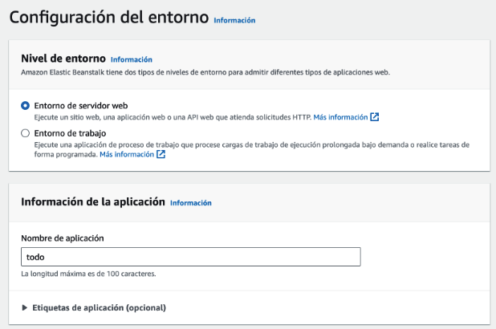

# Primera actividad

El objetivo de esta actividad es ejecutar una aplicación en forma local utilizando `docker`, y en aws utilizando `elasticbeanstack`. Se espera que los equipos cumplan con el desafío técnico al mismo tiempo que reflexionan sobre cuestiones de implementación y despliegue relacionadas con los temas vistos en el curso.

A lo largo de esta guía aparecen preguntas y pedidos de captura de pantalla. El entregable deberá ser un documento que incluya las respuestas a las preguntas y capturas pedidas, que se debe entregar en la actividad creada a tal fin en aulas.

Los equipos deben resolver las posibles dificultades que surjan a lo largo del proceso por su cuenta. En caso de no poder cumplir con alguno de los pasos, se deberá dejar captura del error obtenido y una explicación de porque entienden que se genera.

Cada paso de esta guía tiene un tiempo máximo sugerido. Si no lo completa pasado ese tiempo se recomienda dejar la explicación correspondiente en el documento y pasar al siguiente.

# Paso 0: Pre-requisitos

1. Contar con una máquina en la que poder ejecutar `docker` y `docker-compose`
2. Contar con un cliente web que permita realizar peticiones http (postman, curl o cualquier otro)
3. Clonar este repo en alguna carpeta en el disco

## Paso 1: Ejecución local (15 minutos)

Acceda a la carpeta `todo` del repo clonado y dedique unos minutos a entender el código de la aplicación (archivo `main.go`) y el `Dockerfile`.

__Pregunta 1: Explique los pasos del archivo `Dockerfile`. ¿Porque cree que hay dos directivas `FROM` en el mismo?__

Construya la imagen especificada en el `Dockerfile` y ejecute un contenedor con la misma siguiendo estos pasos en una consola:

```
docker build -t todo .
docker run -p 8080:8080 todo
```

__Captura 1: Muestre el resultado de la consola al ejecutar el contenedor__

Con el contenedor funcionando, utilizar un cliente _http_ para realizar los siguientes _requests_:

```
GET     http://localhost:8080/tasks
POST    http://localhost:8080/tasks  BODY: { "description": "my first task"}
POST    http://localhost:8080/tasks  BODY: { "description": "my second task"}
GET     http://localhost:8080/tasks
```

__Captura 2: Muestre el resultado del último request__

## Paso 2: Ejecución en aws elastic beanstalck (30 minutos)

Cree un archivo llamado `todo.zip` con todos los archivos del directorio `todo`. Importante: el zip debe tener todos los archivos en la raíz, no un directorio dentro. La forma más fácil es seleccionar todos los archivos y crear el zip en base a eso (no en base a la carpeta).

Acceda a su cuenta en el lab de aws y dentro de la consola a Elastic Beanstalk:


Seleccionar la opción de "Crear Aplicación":


Vamos a desplegar la aplicación. Para ello utilice los valores de las siguientes capturas de pantalla. Para los demás solo deje los valores por defecto:




En este paso, seleccionar el archivo `.zip` generado anteriormente.


Luego continuar con "Siguiente" hasta el final y lanzar el despliegue con el botón de "Enviar".

Esto va a llevar unos minutos, pero al terminar debería tener su aplicación desplegada en aws.

Mientras espera que termine, lea las definiciones de _Application_, _Application Version_ y _Environment_ de [esta guía](https://docs.aws.amazon.com/elasticbeanstalk/latest/dg/concepts.html) (acaba de crear una de cada una).

__Pregunta 2: ¿Cual se le ocurre sería un uso común para el concepto de `Environment` en la vida real?__

Una vez que el proceso de crear el ambiente termine, elastic beanstalk mostrará la url que se le asignó:


Repita los requests del paso 1, pero esta vez reemplazando `localhost:8080` por la url del ambiente desplegado:


```
GET     http://<url-ambiente>/tasks
POST    http://<url-ambiente>/tasks  BODY: { "description": "my first task"}
POST    http://<url-ambiente>/tasks  BODY: { "description": "my second task"}
GET     http://l<url-ambiente>/tasks
```

__Captura 3: Muestre el resultado del último request__

## Paso 3: base de datos y docker compose (20 minutos)


Cambie el directorio del repo a `todo2`. Dedique unos minutos a revisar el código de la aplicación (`main.go`).

Luego revise el contenido del archivo `Docker-compose.yml`.

__Pregunta 3: Explique el contenido del archivo `Docker-compose.yml` con sus palabras. ¿Que hace? ¿Que particularidades encuentra?__

El archivo referencia la imagen `todo2`, así que antes de seguir la debemos "buildear". Con una consola parada en la carpeta `todo2` ejecutar:

```
docker build -t todo2 .
```

Cuando la imagen esté lista, es posible iniciar todo mediante:

```
docker-compose up
```

__Captura 4: mostrar una captura de pantalla con el resultado del comando ejecutado__

Luego, volver a probar los requests:

Con el contenedor funcionando, utilizar un cliente _http_ para realizar los siguientes _requests_:

```
GET     http://localhost:8080/tasks
POST    http://localhost:8080/tasks  BODY: { "description": "my first task"}
POST    http://localhost:8080/tasks  BODY: { "description": "my second task"}
GET     http://localhost:8080/tasks
```

__Captura 5: Muestre el resultado del último request__

__Pregunta 4: Revise el código y el archivo docker compose, y de su opinión sobre si la solución cumple o no con el factor 3 (_Config_) de _12 factor_. Justifique su respuesta.__


## Paso 4: base de datos en aws (20 minutos)

Cree una base de datos del tipo _mysql_ en aws. Los parámetros recomendados son los siguientes:


Para este paso recomendamos utilizar las mismas credenciales que se utilizaron en el archivo `Docker-compose.yaml`


La base de datos demorará varios minutos en crearse. Una vez creada, es posible conectarse desde su máquina con un cliente de mysql. Si no tiene uno, puede utilizar [MySql Workbench](https://dev.mysql.com/downloads/workbench/).

Al crear la base la misma expone una url externa, que puede ser utilizada para configurar una conexión en el cliente:


Una vez conectado, crear un _schema_ y ejecutar el contenido del archivo `init.sql`:


## Paso 5: Deploy final en aws (Desafío para lo que quede de tiempo)

Generar un nuevo zip, esta vez con los archivos `Dockerfile`, `go.mod`, `go.sum` y `main.go` de la carpeta `todo2`. Repetir los pasos del "Paso 2" para desplegar la aplicación, solo que esta vez, en lugar de crear la aplicación deberá intentar definir un nuevo ambiente para la aplicación creada.

El objetivo es desplegar la versión en `todo2`, pero apuntando a la base de datos en _rds_.

Para ello, a la hora de definir el ambiente deberá proporcionar los valores de las variables de ambiente utilizados en el _docker compose_. Como ayuda, debería ser algo similar a esto:


Cuando el ambiente termine de levantar, pruebe con los reuests utilizados antes, actualizando la url del ambiente:

```
GET     http://<url-ambiente>/tasks
POST    http://<url-ambiente>/tasks  BODY: { "description": "my first task"}
POST    http://<url-ambiente>/tasks  BODY: { "description": "my second task"}
GET     http://l<url-ambiente>/tasks
```

__Ultima Captura: Mostrar el resultado final__

__Importante: este paso es el más complejo y puede fallar por múltiples motivos. En caso de no lograr la aplicación funcional, agregar la evidencia de hasta donde se llegó o los errores obtenidos en el documento__

__Ultima Pregunta: ¿Que le pareció este ejemplo? ¿Aportó algo que no conocía?__

### Paso Final

Entregue el documento con las capturas y respuestas en aulas, y termine el laboratorio borrando todos los recursos creados, tanto en `elastic beanstalk` como en `rds`.


